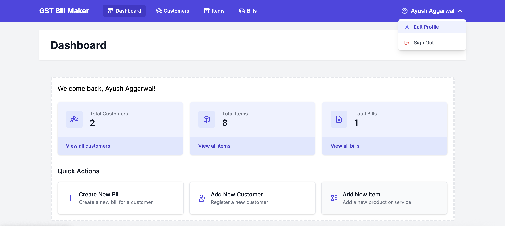

# GST Bill Maker

A modern, user-friendly application for creating and managing GST bills. Built with Next.js, Prisma, and PostgreSQL.

🌐 **Hosted on  Netlify**: [https://gstbillmaker.netlify.app](https://gstbillmaker.netlify.app) 

🎬 **To Start Self Demo**: [https://demogstbillmaker.netlify.app](https://demogstbillmaker.netlify.app/) 

```
  Creds for Demo Env
  Organization Name - ayush1
  Email - ayush1@ayush.com
  Password - ayush1@ayush.com
```



## Features

### Security & Access Control
- 🔐 **Multi-tenant Architecture**:
  - Complete data isolation between organizations
  - Tenant-specific data access and management
  - Secure resource partitioning
- 👥 **Role-Based Access Control (RBAC)**:
  - Admin role: Full system access
  - User role: Limited operational access
  - Custom role permissions
- 🔒 **Security Features**:
  - Secure authentication with NextAuth
  - Data encryption in transit
  - Tenant-level audit trails

### Core Features
- 📊 **Dashboard**: Overview of your billing activities
- 👥 **Customer Management**: Add and manage your customers
- 📝 **Item Management**: Maintain your product/service catalog
- 🏢 **Business Profile**: Manage your company details

### Billing Features
- 💰 **GST Billing**: Create professional GST bills
  - Automatic tax calculations (CGST/SGST/IGST)
  - Automatic bill number generation
  - Support for delivery address
  - Print and download individual bills
- 📄 **Bulk Operations**:
  - Generate multiple bills as PDF
  - Export bills to Excel with detailed analysis
  - Bulk selection and actions

### Search and Filtering
- 🔍 **Advanced Search**:
  - Search by bill number
  - Filter by customer name
  - Date range filtering
- 📊 **Export Analysis**:
  - Bills summary
  - Item-wise analysis
  - Price variation analysis
  - Detailed sales reports

### User Experience
- 📱 **Responsive Design**: Works seamlessly on desktop and mobile devices
- 🎨 **Modern UI**: Clean and intuitive interface
- ⚡ **Real-time Updates**: Instant search and filtering
- 📋 **Bulk Actions**: Efficient management of multiple bills


## API Routes [Complete API Guide](API_Docs.md)

- **Authentication & Authorization**
  - POST `/api/auth/register`: User registration with tenant assignment
  - POST `/api/auth/login`: User login with role validation
  - GET `/api/auth/me`: Get current user profile with roles

- **Tenant Management**
  - GET `/api/tenants`: List all tenants (admin only)
  - POST `/api/tenants`: Create new tenant
  - PUT `/api/tenants/[id]`: Update tenant settings
  - GET `/api/tenants/[id]/users`: List tenant users

- **Profile**
  - GET `/api/profile`: Get business profile
  - POST `/api/profile`: Update business profile

- **Customers**
  - GET `/api/customers`: List all customers (tenant-scoped)
  - POST `/api/customers`: Create new customer
  - PUT `/api/customers/[id]`: Update customer
  - DELETE `/api/customers/[id]`: Delete customer

- **Items**
  - GET `/api/items`: List all items (tenant-scoped)
  - POST `/api/items`: Create new item
  - PUT `/api/items/[id]`: Update item
  - DELETE `/api/items/[id]`: Delete item

- **Bills**
  - GET `/api/bills`: List all bills with search and filters (tenant-scoped)
  - POST `/api/bills`: Create new bill
  - GET `/api/bills/[id]`: Get bill details
  - DELETE `/api/bills/[id]`: Delete bill
  - POST `/api/bills/bulk-htmls`: Generate bulk PDFs
  - POST `/api/bills/export`: Export bills to Excel

## Data Model

### Key Entities
- **Tenant**: Organization/Business unit
- **User**: System user with role assignments
- **Role**: Access control role (Admin, User, etc.)
- **Permission**: Granular access rights
- **Customer**: Customer information (tenant-scoped)
- **Item**: Product/service catalog (tenant-scoped)
- **Bill**: GST bills (tenant-scoped)

## Contributing

1. Fork the repository
2. Create your feature branch (`git checkout -b feature/AmazingFeature`)
3. Commit your changes (`git commit -m 'Add some AmazingFeature'`)
4. Push to the branch (`git push origin feature/AmazingFeature`)
5. Open a Pull Request

## Support

For support, please create an issue in the GitHub repository or contact the maintainers.
